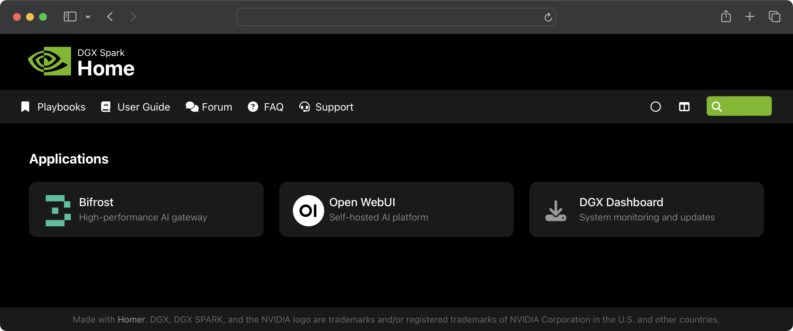
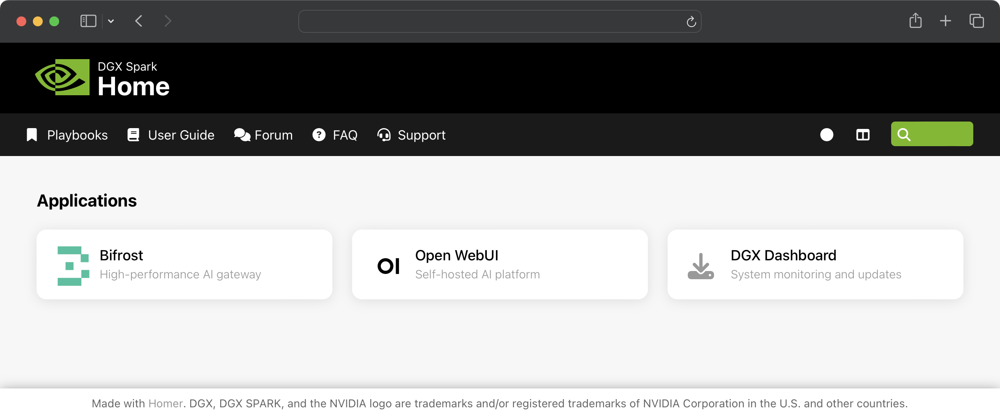

# Spark Home

A static home page for the NVIDIA DGX Spark based on [Homer](https://github.com/bastienwirtz/homer)
by Bastien Wirtz.

## Highlights

- ⚡️ Lightweight & Fast
- 🥱 Low / No maintenance
- 📄 Simple [yaml](http://yaml.org/) file configuration
- ➕ Installable (pwa)
- 🔍️ Fuzzy search
- 📂 Multi pages & item grouping
- ⌨️ keyboard shortcuts:
  - <kbd>/</kbd> Start searching.
  - <kbd>Escape</kbd> Stop searching.
  - <kbd>Enter</kbd> Open the first matching result (respects the bookmark's `_target` property).
  - <kbd>Alt</kbd> (or <kbd>Option</kbd>) + <kbd>Enter</kbd> Open the first matching result in a new tab.

## Screenshots

### Dark mode

<p align="center">
  
</p>

### Light mode

<p align="center">
  
</p>

## Table of Contents

- [Getting started](#get-started)
- [Configuration](docs/configuration.md)
- [Smart cards](docs/customservices.md)
- [Development](docs/development.md)

## Get started

Spark Home is a full static html/js home page, based on a simple yaml configuration file. See [documentation](docs/configuration.md) for information about the configuration (`assets/config.yml`) options.

It's meant to be served by an HTTP server, **it will not work if you open the index.html directly over file:// protocol**.

### Using docker

The configuration directory is bind mounted to make your home page easy to maintain.

**Build the image with `docker build`**

```sh
docker build -t spark-home .
```

**Start the container with `docker run`**

```sh
# Make sure your local config directory exists
docker run -d \
  --name spark-home \
  -p 8080:8080 \
  --mount type=bind,source="/path/to/config/dir",target=/www/assets \
  --restart=unless-stopped \
  spark-home
```

> [!NOTE]  
> The container will run using a user uid and gid 1000 by default, add `--user <your-UID>:<your-GID>` to the docker command to adjust it if necessary. Make sure this match the permissions of your assets directory.

**or `docker-compose`**

```yaml
services:
  spark-home:
    build: .
    container_name: spark-home
    volumes:
      - /path/to/config/dir:/www/assets # Make sure your local config directory exists
    ports:
      - 8080:8080
    user: 1000:1000 # default
    environment:
      - INIT_ASSETS=1 # default, requires the config directory to be writable for the container user (see user option)
    restart: unless-stopped
```

**Environment variables:**

- **`INIT_ASSETS`** (default: `1`)
Install example configuration file & assets (favicons, ...) to help you get started.

- **`SUBFOLDER`** (default: `null`)
If you would like to host Spark Home in a subfolder, (ex: *<http://my-domain/home>*), set this to the subfolder path (ex `/home`).

- **`PORT`** (default: `8080`)
If you would like to change internal port of Spark Home from default `8080` to your port choice.

- **`IPV6_DISABLE`** (default: 0)
Set to `1` to disable listening on IPv6.

### Build manually

```sh
pnpm install
pnpm build
```

Then your home page is ready to use in the `/dist` directory.

## Copyright and Trademark Notice

DGX, DGX SPARK, and the NVIDIA logo are trademarks and/or registered trademarks
of NVIDIA Corporation in the U.S. and other countries.
